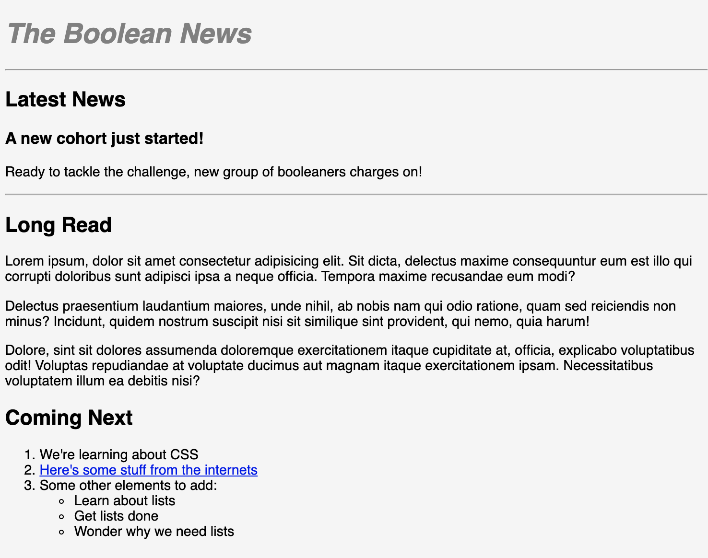

# HTML Boolean News
Today we're going to build a simple newspaper article using HTML.

## Instructions
Replicate the newspaper article below using HTML:

The `index.html` file contains an initial HTML template you can use to get started.

## Tips 
- Think about the page structure
- Break it down one element at a time

## Challenge
- Add an image under the "Latest News" heading with appropriate sizing